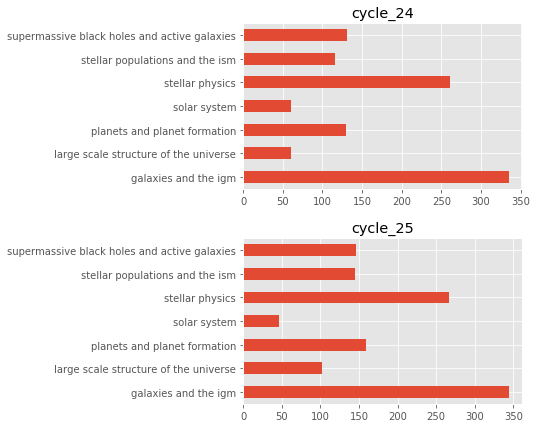
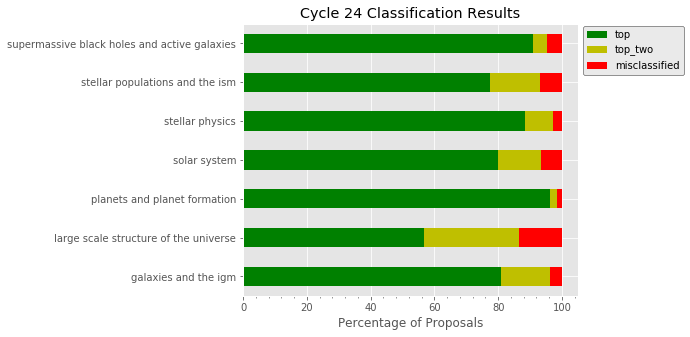

.. code:: ipython3

    # native python
    import os
    import sys
    cwd = os.getcwd()
    pacman_directory = os.path.join('/',*cwd.split('/')[:-1])
    sys.path.append(pacman_directory)
    
    # open source packages
    import matplotlib.pyplot as plt
    plt.style.use('ggplot')
    import numpy as np
    import pandas as pd
    from sklearn.metrics import confusion_matrix, classification_report
    from sklearn.model_selection import cross_val_score, train_test_split
    
    # custom packages that are all in the github repo
    from pacman2020 import PACManTrain, PACManPipeline
    from utils.proposal_scraper import HSTProposalScraper
    from utils.analyzer import PACManAnalyze

1. Proposal Scraping
~~~~~~~~~~~~~~~~~~~~

We use the ``HSTProposalScraper`` class contained in the
``proposal_scraper`` module in the ``utils`` subpackage. We specify that
we are scraping the proposals with the intention of using them for
training and that we only want to scrape proposals in Cycle 24. - By
setting ``for_training=True``, the software automatically looks for a
file containing the hand classifications for the list of proposals and
saves the scraped proposal information in an subdirectory of
``~/PACMan_dist/training_data/``. In this example, the subdirectory will
be named ``training_corpus_cy24`` and it will contain all of the
training data for the given cycle, as well as the file containing the
hand classifications. - For the hand classifications, we adopt the
following naming convention: cycle_CYCLENUMBER_hand_classifications.txt
- e.g. cycle_24_hand_classifications.txt contains the hand
classification of each proposal for cycle 24. - Additionally, the file
should only contain two columns, ``proposal_num`` and
``hand_classification``. Below is an example snippet of what the file
should look like:

.. code:: console

   proposal_num,hand_classification
   0001,stellar physics
   0002,stellar physics
           .
           . 
           .

.. code:: ipython3

    # Make an instance of the proposal scraping and scrape each cycle
    pacman_scraper = HSTProposalScraper(for_training=True, cycles_to_analyze=[24, 25])
    pacman_scraper.scrape_cycles()

.. parsed-literal::

    INFO [proposal_scraper.scrape_cycles:546] /Users/nmiles/PACMan_dist/proposal_data/Cy24_proposals_txt/*txtx
    INFO [proposal_scraper.scrape_cycles:549] Found 1093 proposals to scrape
    Scraping Proposals: 100%|██████████| 1093/1093 [00:02<00:00, 468.60it/s]
    INFO [proposal_scraper.scrape_cycles:546] /Users/nmiles/PACMan_dist/proposal_data/Cy25_proposals_txt/*txtx
    INFO [proposal_scraper.scrape_cycles:549] Found 1208 proposals to scrape
    Scraping Proposals: 100%|██████████| 1208/1208 [00:02<00:00, 464.06it/s]

2. Text Preprocessing (it could be a while… )
~~~~~~~~~~~~~~~~~~~~~~~~~~~~~~~~~~~~~~~~~~~~~

The ``PACManTrain`` class contained in the ``pacman2020`` module to is
capable of performing all of the necessary preprocessing steps. Just
like before, we specify the cycles we want to analyze and in this case
it is just cycle 24.

In summary, this step is processing each input proposal with the
``spaCy`` NLP package to generate a ``Doc`` object, which is a sequence
of tokens. Each token is an individual word that contains a variety of
semantic information derived from the word and its context in a
sentence. We leverage this information to filter out stop words,
punctuations, etc… This is the slowest step of the entire process and if
needed, it can be improved using the multithreading behavior of
``spaCy``.

The text preprocessing steps taken about 11 minutes per cycle.

.. code:: ipython3

    pacman_training = PACManTrain(cycles_to_analyze=[24, 25])
    pacman_training.read_training_data(parallel=False)

.. parsed-literal::

    INFO [pacman2020.read_training_data:392] Reading in 1093 proposals...
    Data Directory: /Users/nmiles/PACMan_dist/training_data/training_corpus_cy24
    100%|██████████| 1093/1093 [09:11<00:00,  1.98it/s]
    INFO [pacman2020.preprocess:290] Total time for preprocessing: 9.197
    INFO [pacman2020.read_training_data:392] Reading in 1208 proposals...
    Data Directory: /Users/nmiles/PACMan_dist/training_data/training_corpus_cy25
    100%|██████████| 1208/1208 [10:13<00:00,  1.97it/s]
    INFO [pacman2020.preprocess:290] Total time for preprocessing: 10.218

For each proposal cycle in the ``cycle_to_analyze`` argument, the
tokenizer will perform the necessary preprocessing steps and save the
proposal number, text, cleaned text, filename, the hand classified
science category, and the encoded value of the hand classified category.
The results are stored in a pandas DataFrame in the
``PACManTrain.proposal_data`` attribute

.. code:: ipython3

    print('Found proposal information for:\n'+'\n'.join(pacman_training.proposal_data.keys())+'\n')
    
    # Print the first 5 rows of the DataFrame for cycle 24
    for key in pacman_training.proposal_data.keys():
        print(f"Displaying some information for {key}...")
        print(pacman_training.proposal_data[key].info())
        print('-'*58)

.. parsed-literal::

    Found proposal information for:
    cycle_24
    cycle_25
    
    Displaying some information for cycle_24...
    <class 'pandas.core.frame.DataFrame'>
    Int64Index: 1093 entries, 0 to 1092
    Data columns (total 6 columns):
    text                           1093 non-null object
    cleaned_text                   1093 non-null object
    fname                          1093 non-null object
    proposal_num                   1093 non-null int64
    hand_classification            1093 non-null object
    encoded_hand_classification    1093 non-null int64
    dtypes: int64(2), object(4)
    memory usage: 59.8+ KB
    None
    ----------------------------------------------------------
    Displaying some information for cycle_25...
    <class 'pandas.core.frame.DataFrame'>
    Int64Index: 1208 entries, 0 to 1207
    Data columns (total 6 columns):
    text                           1208 non-null object
    cleaned_text                   1208 non-null object
    fname                          1208 non-null object
    proposal_num                   1208 non-null int64
    hand_classification            1208 non-null object
    encoded_hand_classification    1208 non-null int64
    dtypes: int64(2), object(4)
    memory usage: 66.1+ KB
    None
    ----------------------------------------------------------

Let’s examine the first proposal in the Cycle 24 DataFrame

.. code:: ipython3

    first_row = pacman_training.proposal_data['cycle_24'].iloc[0]
    msg = (
        f"HST Cycle 24 proposal number: {first_row['proposal_num']}\n"
        f"Hand Classification: {first_row['hand_classification']}\n"
        f"Raw Text:\n{first_row['text'][:100]}...\n"
        f"Cleaned Text:\n{first_row['cleaned_text'][:100]}...\n"
    
    )
    print(msg)

.. parsed-literal::

    HST Cycle 24 proposal number: 954
    Hand Classification: solar system
    Raw Text:
    This proposal seeks to use STIS with one orbit each in 2017, 2018, and 2019 to map the full disk of ...
    Cleaned Text:
    proposal seek stis orbit map disk titan wavelength nm arc sec sampling spatial dimension observation...
    

Side note: pandas is cool.
^^^^^^^^^^^^^^^^^^^^^^^^^^

We can use the resulting DataFrame to quickly examine the distribution
of proposal categories for each cycles.

.. code:: ipython3

    fig, axes = plt.subplots(nrows=2, ncols=1, figsize=(5,7), gridspec_kw={'hspace':0.3})
    for i, key in enumerate(pacman_training.proposal_data.keys()):
        proposal_categories = pacman_training.proposal_data[key]['hand_classification'].value_counts()
        proposal_categories.sort_index(inplace=True)
        ax = proposal_categories.plot.barh(label=key, ax=axes[i])
        ax.set_title(key)

3. Training
~~~~~~~~~~~

Now that we have all the proposal information loaded, we can train a
classifier. When no model or vectorizer is specified, the software will
use the default classifier (Multinomial Naive Bayes) and the default
vectorizer (term frequency-inverse document frequency TFIDF). In theory,
you can pass any combination of vectorizer and classifier that you want!

We test on cycle 25 because the original work was evaluated on cycle 24
data and these are the only two proposal cycles we have that have been
hand classified.

.. code:: ipython3

    pacman_training.fit_model(pacman_training.proposal_data["cycle_25"])

.. code:: ipython3

    print(pacman_training.model)

.. parsed-literal::

    Pipeline(memory=None,
             steps=[('vect',
                     TfidfVectorizer(analyzer='word', binary=False,
                                     decode_error='strict',
                                     dtype=<class 'numpy.float64'>,
                                     encoding='utf-8', input='content',
                                     lowercase=True, max_df=1.0, max_features=10000,
                                     min_df=1, ngram_range=(1, 2), norm='l2',
                                     preprocessor=None, smooth_idf=True,
                                     stop_words=None, strip_accents=None,
                                     sublinear_tf=False,
                                     token_pattern='(?u)\\b\\w\\w+\\b',
                                     tokenizer=None, use_idf=True,
                                     vocabulary=None)),
                    ('clf',
                     MultinomialNB(alpha=0.05, class_prior=None, fit_prior=True))],
             verbose=False)

4. Testing
~~~~~~~~~~

Finally, we evaluate the performance of the model we just trained. To do
so, we use it to make predictions on a completely different proposal
cycle that has also been hand classified. We compare the predictions to
the hand classifications and voila.

.. code:: ipython3

    pacman_training.apply_model(df=pacman_training.proposal_data["cycle_24"], training=True)
    print("scikit-learn classification report")
    print(
        classification_report(
            y_true = pacman_training.model_results['encoded_hand_classification'],
            y_pred = pacman_training.model_results['encoded_model_classification'],
            target_names=pacman_training.encoder.classes_
        )
    )

.. parsed-literal::

    scikit-learn classification report
                                                  precision    recall  f1-score   support
    
                            galaxies and the igm       0.84      0.81      0.82       335
           large scale structure of the universe       0.49      0.57      0.53        60
                    planets and planet formation       0.86      0.96      0.91       130
                                    solar system       0.98      0.80      0.88        60
                                 stellar physics       0.92      0.89      0.90       261
                 stellar populations and the ism       0.74      0.78      0.76       116
    supermassive black holes and active galaxies       0.89      0.91      0.90       131
    
                                        accuracy                           0.84      1093
                                       macro avg       0.82      0.82      0.81      1093
                                    weighted avg       0.84      0.84      0.84      1093
    

Finally, we use the analysis class to compute our customized accuracy to
allow for a comparison with the previous package.

.. code:: ipython3

    pacman_analyzing = PACManAnalyze()
    pacman_analyzing.encoder = pacman_training.encoder

.. code:: ipython3

    pacman_analyzing.compute_accuracy_measurements(df=pacman_training.model_results, normalize=True)

.. parsed-literal::

    Total number of galaxies and the igm proposals in top: 0.81
    Total number of galaxies and the igm proposals in top_two: 0.15
    Total number of galaxies and the igm proposals in misclassified: 0.04
    ------------------------------------------------------------
    Total number of large scale structure of the universe proposals in top: 0.57
    Total number of large scale structure of the universe proposals in top_two: 0.30
    Total number of large scale structure of the universe proposals in misclassified: 0.13
    ------------------------------------------------------------
    Total number of planets and planet formation proposals in top: 0.96
    Total number of planets and planet formation proposals in top_two: 0.02
    Total number of planets and planet formation proposals in misclassified: 0.02
    ------------------------------------------------------------
    Total number of solar system proposals in top: 0.80
    Total number of solar system proposals in top_two: 0.13
    Total number of solar system proposals in misclassified: 0.07
    ------------------------------------------------------------
    Total number of stellar physics proposals in top: 0.89
    Total number of stellar physics proposals in top_two: 0.09
    Total number of stellar physics proposals in misclassified: 0.03
    ------------------------------------------------------------
    Total number of stellar populations and the ism proposals in top: 0.78
    Total number of stellar populations and the ism proposals in top_two: 0.16
    Total number of stellar populations and the ism proposals in misclassified: 0.07
    ------------------------------------------------------------
    Total number of supermassive black holes and active galaxies proposals in top: 0.91
    Total number of supermassive black holes and active galaxies proposals in top_two: 0.05
    Total number of supermassive black holes and active galaxies proposals in misclassified: 0.05
    ------------------------------------------------------------

.. code:: ipython3

    print(f"computed accuracy: {pacman_analyzing.computed_accuracy['top'].sum()/pacman_analyzing.computed_accuracy.sum().sum():.0%}")

.. parsed-literal::

    computed accuracy: 82%

.. code:: ipython3

    pacman_analyzing.cycle=24

.. code:: ipython3

    pacman_analyzing.plot_barh(100*pacman_analyzing.computed_accuracy.loc[:,['top','top_two','misclassified']], fout='test.png')

Saving the results and model
^^^^^^^^^^^^^^^^^^^^^^^^^^^^

To provide a means of benchmarking various models, the classes have the
functionality for saving the model results, as well as the trained
model. By passing the ``training=True`` in the cell below, we are
telling the code to save the results in the training subdirectory of the
results directory. When ``training=False`` is passed, the results are
written to the production directory. The intention here is to keep the
results from training separate from the results when new proposals are
analyzed. The path to each directory is given below:

-  ~/PACMan_dist/model_results/training/
-  ~/PACMan_dist/model_results/production/

.. code:: ipython3

    pacman_training.save_model_results(fout='example_pacmaproposal_datacycle24.txt', training=True)
    pacman_training.save_model(fname='example_pacman_model.joblib')

.. parsed-literal::

    INFO [pacman2020.save_model:459] Saving model and encoder information...

